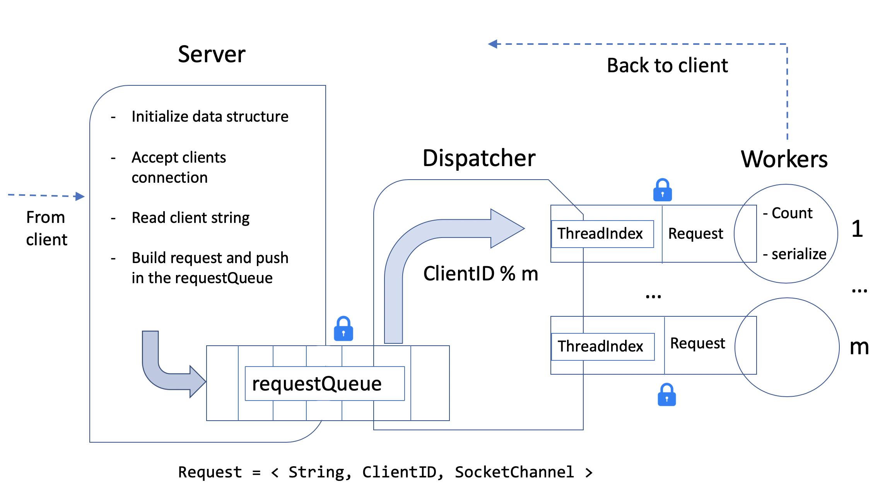
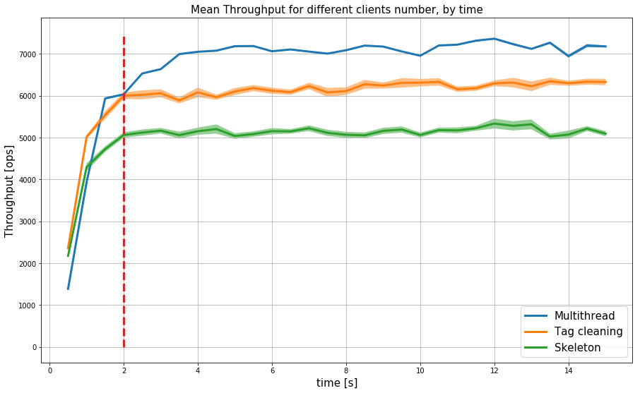
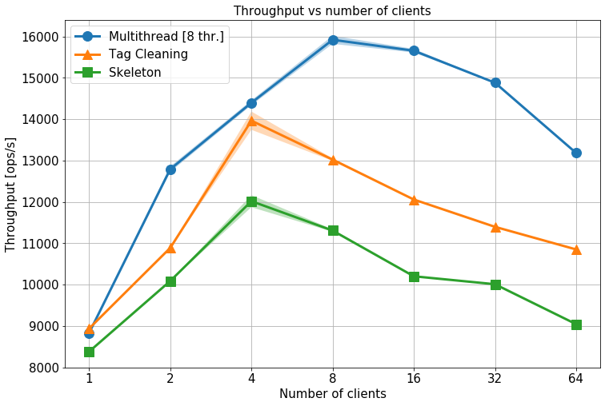
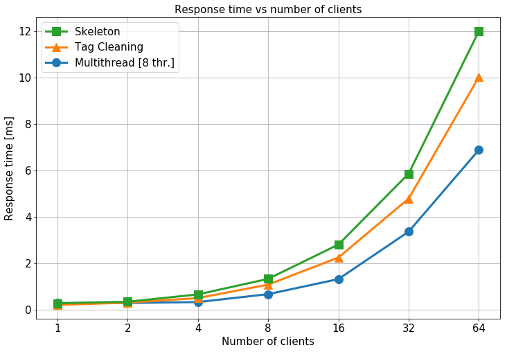
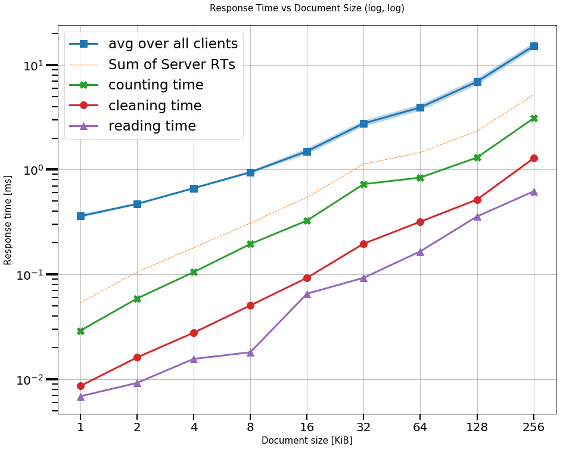

# Benchmarking

A client-server words count application, useful for measure some metrics of the performaces of the system.
The client sends an HTML document, and the server replies with a series of pairs <word, count>.

## The architecture

Three different implementation of the server are proposed for comparison.

### 1. Skeleton

Single thread, with no html tag cleaning. The document is a raw html file, and the content of the tag blocks are included in the count.

### 2. Tag cleaning

Still single thread, but only the text outside the tags is processed.

### 3. Multithread

#### The Server

The main thread is the skeleton of the server. He initializes all the data structure and launch dispatcher thread. He accepts the requests from clients, he read the lines of text from sockets, he cleans them from HTML tag, and then he puts them in a LinkedList, `requestQueue`, notifying the dispatcher thread.\
He also aggregates all the statics and writes them to file.

#### The dispatcher

The dispatcher creates and initializes the worker threads. To each worker is assigned an index. Then, he waits for new requests in the request queue, once he founds it non-empty, he extracts the first request (in FIFO order) and assign it to a worker thread. The assignment is done by calculating the modulus between the ClientID associated to the request and the number of workers.\
Requests are passed to the threads using an `HashMap<ThreadIndex ,Request>` called `requestMap`. If the chosen worker is busy (not waiting), the dispatcher waits until he gets a signal from him.

#### The workers

The worker threads wait for a new request associated to their index in the HashMap. They process it, they send the result back to the client and then they signal the dispatcher in case the dispatcher he is waiting for assigning him a new request.

#### RequestQueue – mutual exclusive access

The accesses to requestQueue are done in mutual exclusive way, by both the server and dispatcher thread.

#### RequestMap – mutual exclusive access

The access to each element in the requestMap is done in mutual exclusive way, between the dispatcher and the only one thread who can access the request associated to his index. I implemented this behavior with an array of objects, one for each worker threads, representing the locks.

## Warm up time

Observing the plot of the mean of throughput over the clients, I decided to fix the warm-up time to 2 seconds.\
Considering that most of the experiments lasts more than one minute, removing or not the measurement taken during the warm-up time, does not change the plots.

## Different number of clients

For the first set of experiment, with fixed document size to 4KB, I set eight worker threads for the multithread version, while I variate the number of repetitions, decrementing them with higher number of clients, for having a total time of the experiments more similar over the different number of clients.\

### Throughput and response time 

We rich the saturation point around 16 clients for the multithread version, and even before in the other two cases.

The tag cleaning operation, even if add an overhead to the skeleton, result in an overall improvement due to the less words to count.

## Different document size

Note that there is one order of magnitude of difference between the response time measured by the client and the response times of the four server tasks. The counting operation is the most expensive one, as expected. The graph underline how the client request spent a considerable time waiting before being processed.
